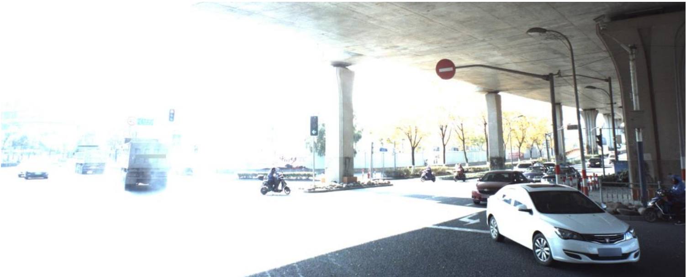
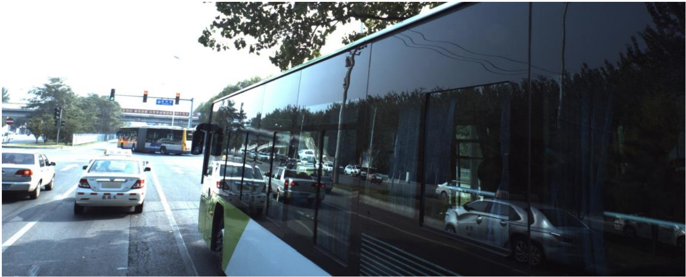
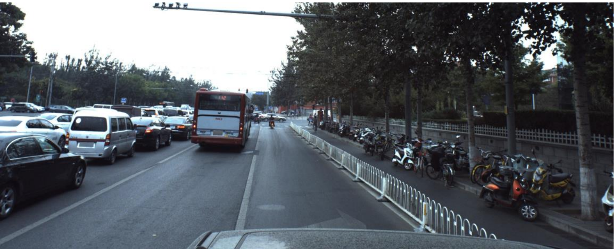

# Machine Learning Engineer Nanodegree
## Capstone Proposal
Grégory D'Angelo  
April 5, 2018

## CVPR 2018 WAD Video Segmentation Challenge

### Domain Background

Building self-driving cars and autonomous vehicles are one of the most challenging AI project of our days. Several companies, from car manufacturers to tech giants through a plethora of startups, are all competing in race to build the future of mobility. A crucial part of autonomous driving is perception to acquire an accurate understanding of the environment in which the car is operating. Indeed, the [recent tragic accident involving a self-driving car][1] reaffirms how important it is to sense the world around the car.

Hence, as an aspiring self-driving car engineer, I'm going to tackle this problem as part of my [Machine Learning Nanodegree][2] capstone project. With the knowledge gained from this nanodegree and the [Self-Driving Cars Nanodegree][3], I will participate to the *CVPR 2018 WAD Video Segmentation Challenge* on [Kaggle][4]. This challenge is a unique opportunity to work on a tremendously high value and high profile problem for autonomous driving.

### Problem Statement

Sensing the surrounding environment is very important for an autonomous vehicle to operate safely in it. A fully attentive human-being can easily and reflexively differentiate between objects/instances, such as person vs. a stop sign, when driving. However, for autonomous vehicles, this task is not as trivial as it is for human drivers. Hence, this Kaggle challenge aims to solve this environmental perception problem for autonomous driving.

In this challenge, I'll have a set of video sequences with fine per-pixel labeling, in particular instances of moving/movable objects such as vehicles and pedestrians are also labeled. The goal is to evaluate the state of the art in video-based object segmentation, a task that has not been evaluated previously due to the lack of fine labeling. The average moving/movable instances per frame can be over 50, in comparisons, only up to 15 cars/pedestrians are labelled in the [KITTI dataset][5]. Some very challenging environments, such as harsh traffic and lighting conditions, have been captured as shown in the following images (center-cropped for visualization purpose).

### Datasets and Inputs

To solve the scene parsing problem, I'll use the [ApolloScape][6] [dataset][7] provided by Baidu, Inc. It contains survey grade dense 3D points and registered multi-view RGB images at video rate, and every pixel and every 3D point are semantically labelled. In addition precise pose for each image is provided. The subset used for this challenge has around 60K image frames and corresponding instance-level annotations. For details about the class definitions and dataset structure please refer to [ApolloScape website][7].

The authors equipped a mid-size SUV with high resolution cameras and a Riegl acquisition system. The dataset is collected in different cities under various traffic conditions. The number of moving objects, such as vehicles and pedestrians, averages from tens to over one hundred. Image frames in the dataset are collected every one meter by the acquisition system with resolution 3384 x 2710.

The dataset is divided into three subsets for original training images, training images labels and test sets iamges respectively.

### Solution Statement

### Benchmark Model
_(approximately 1-2 paragraphs)_

In this section, provide the details for a benchmark model or result that relates to the domain, problem statement, and intended solution. Ideally, the benchmark model or result contextualizes existing methods or known information in the domain and problem given, which could then be objectively compared to the solution. Describe how the benchmark model or result is measurable (can be measured by some metric and clearly observed) with thorough detail.

### Evaluation Metrics
_(approx. 1-2 paragraphs)_

In this section, propose at least one evaluation metric that can be used to quantify the performance of both the benchmark model and the solution model. The evaluation metric(s) you propose should be appropriate given the context of the data, the problem statement, and the intended solution. Describe how the evaluation metric(s) are derived and provide an example of their mathematical representations (if applicable). Complex evaluation metrics should be clearly defined and quantifiable (can be expressed in mathematical or logical terms).

### Project Design
_(approx. 1 page)_

In this final section, summarize a theoretical workflow for approaching a solution given the problem. Provide thorough discussion for what strategies you may consider employing, what analysis of the data might be required before being used, or which algorithms will be considered for your implementation. The workflow and discussion that you provide should align with the qualities of the previous sections. Additionally, you are encouraged to include small visualizations, pseudocode, or diagrams to aid in describing the project design, but it is not required. The discussion should clearly outline your intended workflow of the capstone project.

-----------

**Before submitting your proposal, ask yourself. . .**

- Does the proposal you have written follow a well-organized structure similar to that of the project template?
- Is each section (particularly **Solution Statement** and **Project Design**) written in a clear, concise and specific fashion? Are there any ambiguous terms or phrases that need clarification?
- Would the intended audience of your project be able to understand your proposal?
- Have you properly proofread your proposal to assure there are minimal grammatical and spelling mistakes?
- Are all the resources used for this project correctly cited and referenced?

[1]:https://www.nytimes.com/2018/03/19/technology/uber-driverless-fatality.html

[2]:https://www.udacity.com/course/machine-learning-engineer-nanodegree--nd009t

[3]:https://www.udacity.com/course/self-driving-car-engineer-nanodegree--nd013

[4]:https://www.kaggle.com/c/cvpr-2018-autonomous-driving/data

[5]:http://www.cvlibs.net/datasets/kitti/

[6]:https://arxiv.org/abs/1803.06184

[7]:http://apolloscape.auto/scene.html
